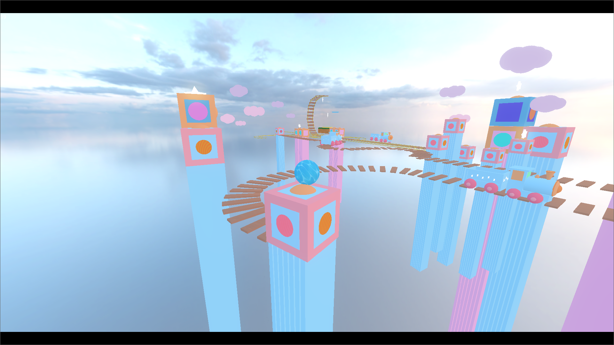
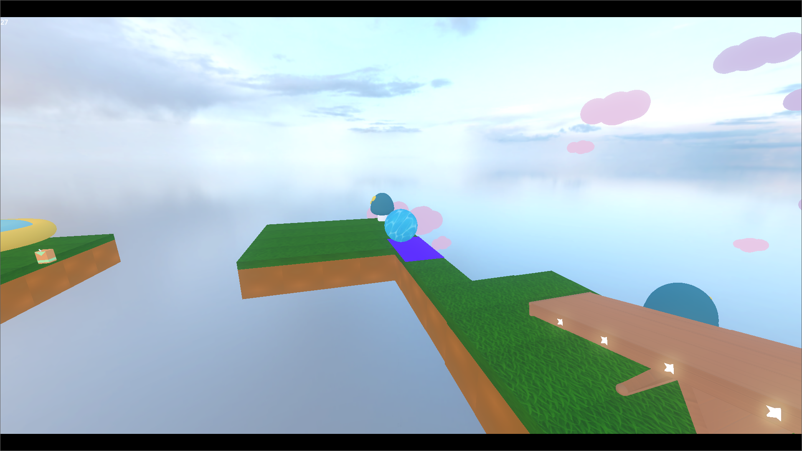

# 🎮 Rollin Dreams

## About the Game

**Rollin Dreams** is a vibrant and fun 3D platformer game developed in Godot. The player controls a character in a world full of challenges, collectibles, and creative mechanics. With trampolines that propel, rails that guide, mysterious portals, and dangerous obstacles, the goal is to advance through levels by collecting fruits and reaching victory.

The game offers an immersive experience with:
- **Movement Mechanics**: Fluid movement with jumps, dynamic falling, and speed variations per level
- **Interactive Elements**: Trampolines for propulsion, rails for navigation, and portals for teleportation
- **Collectibles**: Fruits and stars scattered throughout the levels
- **Audio System**: FMOD integration for immersive sound effects
- **Multiple Levels**: Different environments with progressive difficulty

---

## Screenshots





---

## Team

- **Bianca Oliveira**
- **David Castro**
- **Guilherme Cruz**
- **Raghad Nahas**

---

## Technologies

- **Engine**: Godot 4.x
- **Language**: GDScript
- **Audio**: FMOD Studio
- **3D Modeling**: .glb Models

## Project Structure

```
rollin-dreams/
├── Scenes/          # Game scenes (levels, menu, UI)
├── Scripts/         # GDScript logic
├── Textures/        # Textures and materials
├── Audio/           # Audio files
├── Banks/           # Compiled FMOD banks
└── Object/          # 3D models
```

## How to Run

1. Open the project in Godot 4.x
2. Navigate to the main scene (menu)
3. Click "Play" to start the game

---

Developed for **DDJD - Game Development Project**